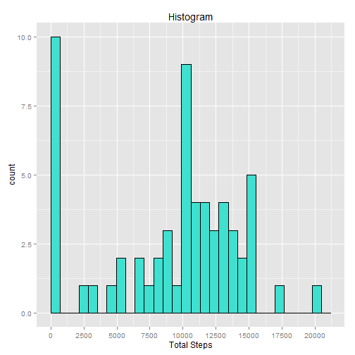
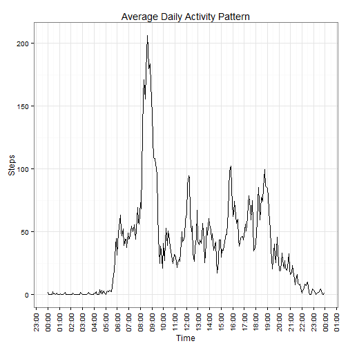
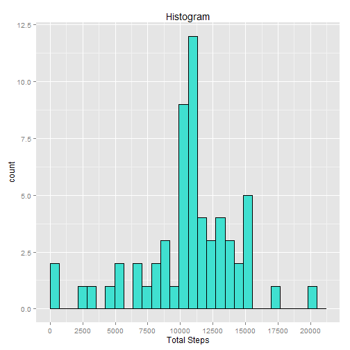
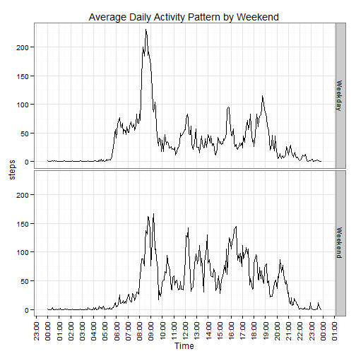

REPRODUCIBLE RESEARCH PEER ASSESSMENT 1
=======================================

##Assignment
This assignment will be described in multiple parts. You will need to write a report that answers the questions detailed below. Ultimately, you will need to complete the entire assignment in a single R markdown document that can be processed by knitr and be transformed into an HTML file.

Throughout your report make sure you always include the code that you used to generate the output you present. When writing code chunks in the R markdown document, always use echo = TRUE so that someone else will be able to read the code. This assignment will be evaluated via peer assessment so it is essential that your peer evaluators be able to review the code for your analysis.

For the plotting aspects of this assignment, feel free to use any plotting system in R (i.e., base, lattice, ggplot2)

Fork/clone the GitHub repository created for this assignment. You will submit this assignment by pushing your completed files into your forked repository on GitHub. The assignment submission will consist of the URL to your GitHub repository and the SHA-1 commit ID for your repository state.

NOTE: The GitHub repository also contains the dataset for the assignment so you do not have to download the data separately.

##Loading and preprocessing the data
Show any code that is needed to

1. Load the data (i.e. read.csv())s
2. Process/transform the data (if necessary) into a format suitable for your analysis

```r
library("ggplot2")
library("scales")

## READ IN DATA
x <- read.csv('activity.csv', stringsAsFactors=FALSE)
```
##What is mean total number of steps taken per day?
For this part of the assignment, you can ignore the missing values in the dataset.

1. Make a histogram of the total number of steps taken each day
2. Calculate and report the mean and median total number of steps taken per day

```r
## CALCULATE THE TOTAL NUMBER OF STEPS TAKEN EACH DAY
total <- aggregate(x$steps, by=list(x$date), sum, na.rm=TRUE)
names(total) <- c('date','totalSteps')

## MAKE HISTOGRAM
ggplot(total, aes(x=totalSteps)) + geom_histogram(colour='black',fill='turquoise') + 
  scale_x_continuous(limits=c(0,max(total$totalSteps)),breaks=seq(0,max(total$totalSteps),by=2500)) +
  labs(x='Total Steps', title='Histogram')
```

 

```r
## CALCULATE THE MEAN AND THE MEDIAN
avg1 <- round(colMeans(total[2]),2)
med1 <- median(total$totalSteps)
```

The mean number of total steps taken per day is 9354.23 and the median number of total steps taken per day is 10395.

##What is the average daily activity pattern?
1. Make a time series plot (i.e. type = "l") of the 5-minute interval (x-axis) and the average number of steps taken, averaged across all days (y-axis)
2. Which 5-minute interval, on average across all the days in the dataset, contains the maximum number of steps?

```r
## CALCULATE THE AVERAGE NUMBER OF STEPS TAKEN, AVERAGED ACROSS ALL DAYS
avgSteps <- aggregate(x$steps, by=list(x$interval), mean, na.rm=TRUE)
names(avgSteps) <- c('Interval','Steps')

## MAKE LINE GRAPH OF THE AVERAGE DAILY ACTIVITY PATTERN AND CONVERT INTERVALS TO TIME
avgSteps$tt <- sprintf("%04d", avgSteps$Interval)
avgSteps$tt1 <- as.POSIXct((avgSteps$tt),format="%H%M")
ggplot(avgSteps, aes(tt1,Steps)) + theme_bw() + geom_line(stat="identity") + 
           labs(x='Time', title='Average Daily Activity Pattern') +
           theme(axis.text.x=element_text(angle=90, vjust=0.4)) +
           scale_x_datetime(labels=date_format("%H:%M"), breaks=date_breaks("1 hour"))
```

 

```r
## CALCULATE AND EXTRACT THE STEPS AND TIME INTERVAL FOR MAXIMUM
maxInterval <- avgSteps[avgSteps$Steps==max(avgSteps$Steps),]
extractSteps <- round(maxInterval$Steps,2)
extractTime <- format(maxInterval$tt1,"%H:%M")
```
The maximum number of steps, average across all days in the data set is 206.17 and occurs at 08:35.

##Imputing missing values
Note that there are a number of days/intervals where there are missing values (coded as NA). The presence of missing days may introduce bias into some calculations or summaries of the data.

1. Calculate and report the total number of missing values in the dataset (i.e. the total number of rows with NAs)
2. Devise a strategy for filling in all of the missing values in the dataset. The strategy does not need to be sophisticated. For example, you could use the mean/median for that day, or the mean for that 5-minute interval, etc.
3. Create a new dataset that is equal to the original dataset but with the missing data filled in.
4. Make a histogram of the total number of steps taken each day and Calculate and report the mean and median total number of steps taken per day. Do these values differ from the estimates from the first part of the assignment? What is the impact of imputing missing data on the estimates of the total daily number of steps?

```r
## CALCULATE THE TOTAL NUMBER OF MISSING VALUES
noOfNA <- nrow(x[is.na(x$steps),])

## IMPUTE MISSING DATA VALUES
xNew <- merge(x,avgSteps,by.x="interval",by.y="Interval",all.x=TRUE)
xNew$steps[is.na(xNew$steps)] <- xNew$Steps[is.na(xNew$steps)]
xNew$Steps <- NULL

## MAKE HISTOGRAM OF THE TOTAL NUMBER OF STEPS TAKEN EACH DAY
totalNew <- aggregate(xNew$steps, by=list(xNew$date), sum, na.rm=TRUE)
names(totalNew) <- c('date','totalSteps')
ggplot(totalNew, aes(x=totalSteps)) + geom_histogram(colour='black',fill='turquoise') + 
  scale_x_continuous(limits=c(0,max(totalNew$totalSteps)),breaks=seq(0,max(totalNew$totalSteps),by=2500)) +
  labs(x='Total Steps', title='Histogram')
```

 

```r
## CALCULATE THE NEW MEDIAN AND MEAN OF THE TOTAL NUMBER OF STEPS TAKEN EACH DAY
avg2 <- format(round(colMeans(totalNew[2]),2),scientific=FALSE)
med2 <- format(median(totalNew$totalSteps),scientific=FALSE)
```
- The number of missing values in the dataset is 2304.
- Because the data is not from a uniform distribution, it did not make sense to impute values from the mean or median for each day.  The distribution appears somewhat normal, though slightly skewed.  Therefore, random values from a normal distribution or the mean from the 5-minute intervals could be used to imputing missing values.  I decided to use the mean from the 5-minute intervals to impute values that are missing.
- The new mean based on imputed values is 10766.19 and the new median is 10766.19.
- Imputing the missing data using the mean from the 5-minute intervals, signficantly increases the mean for the total number of steps taken per day, and increases the median for the total number of steps taken per day, but to a lesser extent.  This indicates, the original data may be skewed, and not normally distributed.  

##Are there differences in activity patterns between weekdays and weekends?
For this part the weekdays() function may be of some help here. Use the dataset with the filled-in missing values for this part.

1. Create a new factor variable in the dataset with two levels - "weekday" and "weekend" indicating whether a given date is a weekday or weekend day.
2. Make a panel plot containing a time series plot (i.e. type = "l") of the 5-minute interval (x-axis) and the average number of steps taken, averaged across all weekday days or weekend days (y-axis). See the README file in the GitHub repository to see an example of what this plot should look like using simulated data.

```r
## CREATE FACTOR VARIABLE WITH TWO LEVELS, WEEKEND AND WEEKDAY
xNew$temp <- weekdays(as.Date(xNew$date))
xNew$weekday <- factor(ifelse((xNew$temp) %in% c('Saturday','Sunday'),'Weekend','Weekday'))
xNew$temp <- NULL

## CREATE PANEL PLOT OF THE AVERAGE NUMBER OF STEPS TAKEN ON WEEKDAY VS WEEKEND
xNewAvg <- aggregate(xNew$steps, by=list(xNew$tt, xNew$weekday), mean)
names(xNewAvg) <- c('time','weekday','steps')

xNewAvg$tt1 <- as.POSIXct(xNewAvg$time,format="%H%M")
ggplot(xNewAvg, aes(tt1,steps)) + theme_bw() +
              facet_grid(weekday~.) + geom_line(stat="identity") +
              labs(x='Time', title='Average Daily Activity Pattern by Weekend') +
              theme(axis.text.x=element_text(angle=90, vjust=0.4)) +
              scale_x_datetime(labels=date_format("%H:%M"), breaks=date_breaks("1 hour"))
```

 

###Conclusion:

There appears to be differences in activity patterns during the weekdays versus the weekends.  This person gets up earlier in the morning, presumably to go to work.  Most of the activity is early in the morning, probably or breakfast and going to work.  During the weekend, the activity is more spreadout throughout the day.  Probably because the person is not rushed to get to work.


